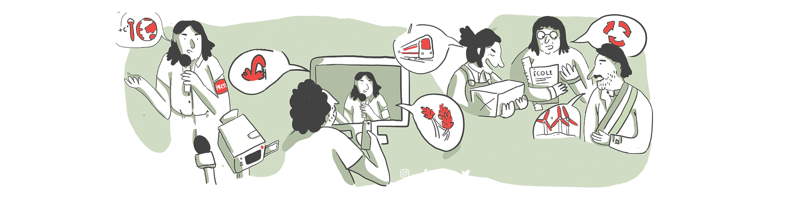

# QuotaClimat


- Pour rejoindre le projet https://dataforgood.fr/join puis sur le Slack #offseason_quotaclimat
- Pour en savoir plus sur le projet https://dataforgood.fr/projects/quotaclimat
- Pour la répartition des tâches https://dataforgood.slite.page/p/xECA5kt9LFqtOA/Comment-contribuer-au-projet-QuotaClimat-x-Data-For-Good

## Structure du repo
```
- data --------------------------------- les données temporairement ici
- notebooks ---------------------------- les analyses
        quickstart.ipynb --------------- un premier notebook Python d'analyse
```

## Open source

Pour l'instant le repo est privé, parce que les données sont privées.
Nous passerons le projet en open source dès que nous aurons réglé la mise en place d'une base de données SQL